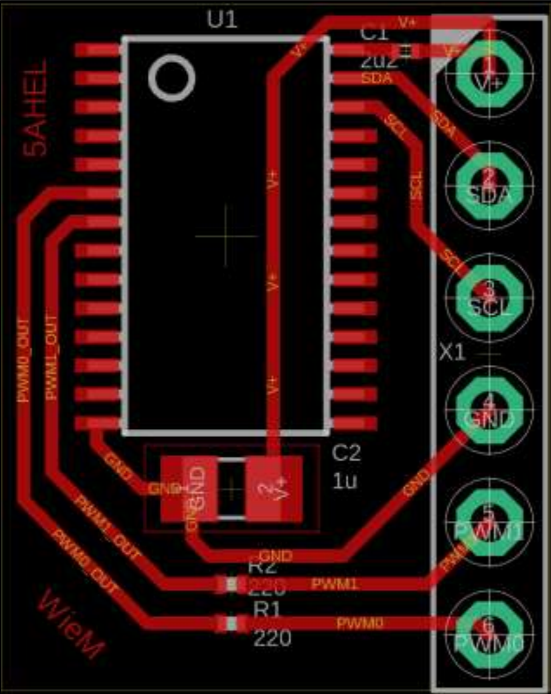

## StratoFlight-Camera

### Test-System
| Name                          | Usage                                                |
| ---                           | ---                                                  |
| Raspberry Pi Model 3B+        | Power source, taking pictures & sending I2C commands |
| Raspberry Pi NoIR Camera V2.1 | Taking pictures with different settings              |
| PWM-PCB with PCA9865          | Creating a PWM-signal over I2C to turn servo motor   |
| Micro Servo 9g (DF9GMS)       | Turning the camera around the z-axis                 |

#### Raspberry Pi Used Pinout
| Pin # | Cable Colour | Name          | Usage                             |
| ---   | ---          | ---           | ---                               |
| 01    | GREEN        | 3.3V DC-Power | Power for GY-271 compass module   |
| 04    | RED          | 5V DC-Power   | Power for servo motor and PCA9685 |
| 03    | WHITE        | SDA1 (I2C)    | SDA for I2C network               |
| 05    | YELLOW       | SCL1 (I2C)    | SCL for I2C network               |
| 39    | BLACK        | Ground        | GND                               |

#### Python-Packages
| Name                                                                    | Usage                                      |
| ---                                                                     | ---                                        |
| picamera                                                                | See images of the Raspberry Pi NoIR-Cam V2 |
| [adafruit-pca9685](https://github.com/adafruit/Adafruit_Python_PCA9685) | Writing the PCA9685 PWM driver             |
| [py_qmc5883l](https://github.com/RigacciOrg/py-qmc5883l)                | Reading the current magnitudal heading     |

***

### Flying-System
| Name 	                        | Usage                                                |
| ---                           | ---                                                  |
| Raspberry Pi Zero             | Power source, taking pictures & sending I2C commands |
| Raspberry Pi NoIR Camera V2.1	| Taking pictures with different settings              |
| PWM-PCB with PCA9865          | Creating a PWM-signal over I2C to turn servo motor   |
| Micro Servo 9g (DF9GMS)       | Turning the camera around the z-axis                 |

***

### PWM-PCB
The PWM-PCB is a simple circuit board which can handle two PWM outputs using the PCA9685 I2C IC to simplify the needed code and take some load off the Pi Zero. One output is then used to set the turning angle of the SER0006 (DF9GMS) servo motor. The other output is not (yet) used.

